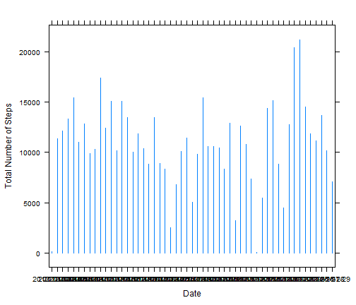
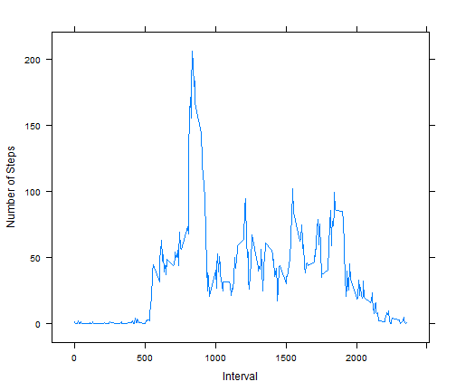
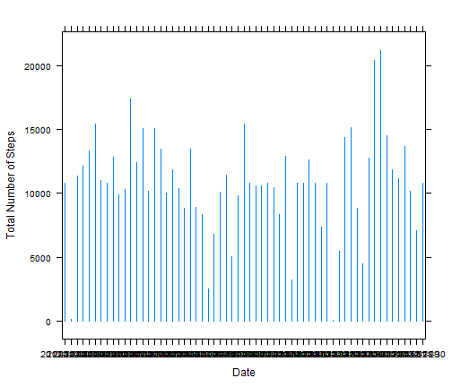
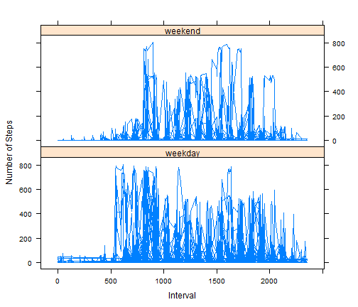

Reproducible Research - Peer Assessment 1
========================================================


```r
# A.Loading and preprocessing the data

setwd("~/GitHub/RepData_PeerAssessment1")
data <- read.csv("activity.csv")
library(lattice)  # used for xy plot

# exploring data
names(data)
```

```
## [1] "steps"    "date"     "interval"
```

```r
# str(data) summary(data$steps) unique(data$steps)

# summary(data$date) length(unique(data$date))

# summary(data$interval) unique(data$interval)
# ------------------------------------------------------------

# data cleansing
refined.data <- data[!(is.na(data$steps)), ]
# str(refined.data) summary(refined.data$steps)
# ------------------------------------------------------------

# B.What is mean total number of steps taken per day?

sum.data <- aggregate(steps ~ date, data = refined.data, FUN = sum)
names(sum.data) <- c("date", "sum.steps")
```


You can also embed plots, for example:


```r
# Figure 1
xyplot(sum.data$sum.steps ~ sum.data$date, layout = c(1, 1), type = "h", xlab = "Date", 
    ylab = "Total Number of Steps")
```

 


```r
mean.data <- aggregate(steps ~ date, data = refined.data, FUN = mean)
names(mean.data) <- c("date", "mean.steps")
head(mean.data)
```

```
##         date mean.steps
## 1 2012-10-02     0.4375
## 2 2012-10-03    39.4167
## 3 2012-10-04    42.0694
## 4 2012-10-05    46.1597
## 5 2012-10-06    53.5417
## 6 2012-10-07    38.2465
```

```r

median.data <- aggregate(steps ~ date, data = refined.data, FUN = c("median"))
names(median.data) <- c("date", "median.steps")
head(median.data)
```

```
##         date median.steps
## 1 2012-10-02            0
## 2 2012-10-03            0
## 3 2012-10-04            0
## 4 2012-10-05            0
## 5 2012-10-06            0
## 6 2012-10-07            0
```


```r
# C. What is the average daily activity pattern? 1. Make a time series plot
# (i.e. type = 'l') of the 5-minute interval (x-axis) and the average number
# of steps taken, averaged across all days (y-axis)
meaninterval.data <- aggregate(steps ~ interval, data = data, FUN = mean)
names(meaninterval.data) <- c("interval", "mean.steps")
```


```r
# Figure 2
xyplot(meaninterval.data$mean.steps ~ meaninterval.data$interval, layout = c(1, 
    1), type = "l", xlab = "Interval", ylab = "Number of Steps")
```

 


```r
# 2.Which 5-minute interval, on average across all the days in the dataset,
# contains the maximum number of steps?

meaninterval.data[meaninterval.data$mean.steps == max(meaninterval.data$mean.steps), 
    1]
```

```
## [1] 835
```

```r
# ---------------------------------------------------------------- D.
# Imputing missing values 1. Calculate and report the total number of
# missing values in the dataset (i.e. the total number of rows with NAs)
NA.data <- data[is.na(data$steps), ]
nrow(NA.data)
```

```
## [1] 2304
```

```r

# ---------------------------------------- 2. Devise a strategy for filling
# in all of the missing values in the dataset. The strategy does not need to
# be sophisticated. For example, you could use the mean/median for that day,
# or the mean for that 5-minute interval, etc.

# 3. Create a new dataset that is equal to the original dataset but with the
# missing data filled in.

# Method 3.1

filled.data <- data
# check column names
intersect(names(mean.data), names(filled.data))
```

```
## [1] "date"
```

```r

# join two tables- bring in mean steps per day to the original database
merged.data <- merge(mean.data, filled.data, all = TRUE)

# Replacing NA values with mean per day
merged.data[is.na(merged.data$steps), ]$steps <- merged.data[is.na(merged.data$steps), 
    ]$mean.steps

# checking operation
NA.mergeddata <- merged.data[is.na(merged.data$steps), ]

refined.data <- data[!(is.na(data$steps)), ]

merged.data[(is.na(merged.data$steps)) & !(is.na(merged.data$mean.steps)), ]
```

```
## [1] date       mean.steps steps      interval  
## <0 rows> (or 0-length row.names)
```

```r
nrow(NA.mergeddata)
```

```
## [1] 2304
```

```r
# This method did not work out. let's try another method!

# --------------------------------------------- Method 3.2
filledinterval.data <- data

meaninterval.data <- aggregate(steps ~ interval, data = data, FUN = mean)
names(meaninterval.data) <- c("interval", "mean.steps")

# check column names
intersect(names(meaninterval.data), names(filledinterval.data <- data))
```

```
## [1] "interval"
```

```r

# join two tables- bring in mean steps per interval to the original database
mergedinterval.data <- merge(meaninterval.data, filledinterval.data, all = TRUE)

# Replacing NA values with mean per interval
mergedinterval.data[is.na(mergedinterval.data$steps), ]$steps <- mergedinterval.data[is.na(mergedinterval.data$steps), 
    ]$mean.steps

# checking operation
NA.mergedintervaldata <- mergedinterval.data[is.na(mergedinterval.data$steps), 
    ]
nrow(NA.mergedintervaldata)  # 0 rows OK - All NULL values are filled up
```

```
## [1] 0
```


```r
# 4.Make a histogram of the total number of steps taken each day and
# Calculate and report the mean and median total number of steps taken per
# day. Do these values differ from the estimates from the first part of the
# assignment? What is the impact of imputing missing data on the estimates
# of the total daily number of steps?


newsum.data <- aggregate(steps ~ date, data = mergedinterval.data, FUN = sum)
names(newsum.data) <- c("date", "newsum.steps")
# par(mfrow = c(2, 1)) plot(sum.data) plot(newsum.data)
```


```r
# Figure 3
xyplot(newsum.data$newsum.steps ~ newsum.data$date, type = "h", xlab = "Date", 
    ylab = "Total Number of Steps")
```

 


```r
newmean.data <- aggregate(steps ~ date, data = mergedinterval.data, FUN = mean)
names(newmean.data) <- c("date", "newmean.steps")
head(newmean.data)
```

```
##         date newmean.steps
## 1 2012-10-01       37.3826
## 2 2012-10-02        0.4375
## 3 2012-10-03       39.4167
## 4 2012-10-04       42.0694
## 5 2012-10-05       46.1597
## 6 2012-10-06       53.5417
```

```r

newmedian.data <- aggregate(steps ~ date, data = mergedinterval.data, FUN = c("median"))
names(newmedian.data) <- c("date", "newmedian.steps")
head(newmedian.data)
```

```
##         date newmedian.steps
## 1 2012-10-01           34.11
## 2 2012-10-02            0.00
## 3 2012-10-03            0.00
## 4 2012-10-04            0.00
## 5 2012-10-05            0.00
## 6 2012-10-06            0.00
```

```r

# ----------------------------------------------------------------------------------------------
# E. Are there differences in activity patterns between weekdays and
# weekends? creating an empty column
refined.data$daytype <- NA
# weekdays(as.POSIXlt('2012-10-02')) as.POSIXlt(refined.data[i, ]$date)$wday
# returns day of week from 0 to 6

for (i in 1:nrow(refined.data)) 
ifelse(as.POSIXlt(refined.data[i, ]$date)$wday %in% c("5", "6"), refined.data[i, 
    ]$daytype <- "weekend", refined.data[i, ]$daytype <- "weekday")

# unique(refined.data$daytype) unique(as.POSIXlt(refined.data$date)$wday)
# class(refined.data$daytype) summary(refined.data$daytype)

# converting to factor
refined.data$daytype <- as.factor(refined.data$daytype)
# ----------------------------------------------------------------
```


```r
# Figure 4
xyplot(refined.data$steps ~ refined.data$interval | refined.data$daytype, layout = c(1, 
    2), type = "l", xlab = "Interval", ylab = "Number of Steps")
```

 


